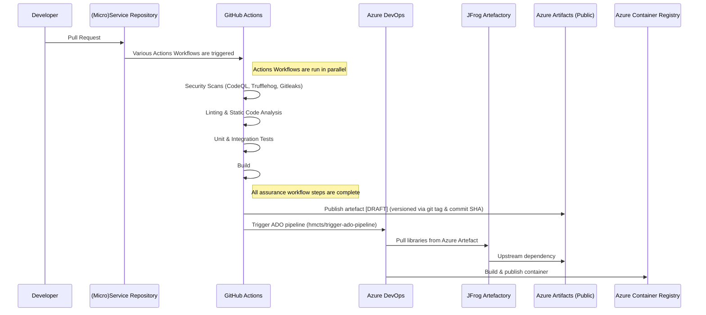
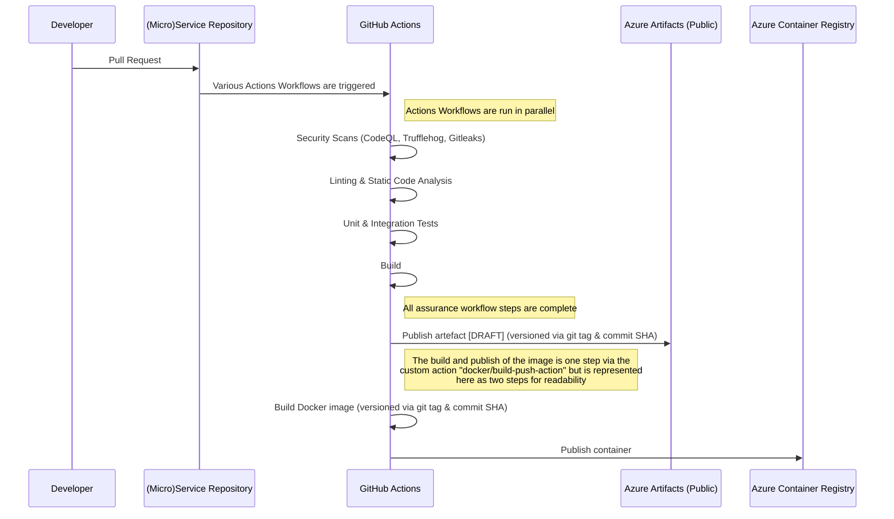

# Pipeline Overview

## Current Pipeline

This diagram summarises the flow up to publishing an image to Azure Container Registry (ACR).

## Proposed Pipeline

This represents the next iteration of the pipeline, simplifying the process by removing Azure DevOps and JFrog Artifactory, 
but more importantly allow the owners of the repository to have full control of the pipeline and publishing the actual artefact that they produce and is used.

The GitHub Actions workflow will handle building and publishing both the application artefact and the Docker image to Azure Container Registry (ACR).

